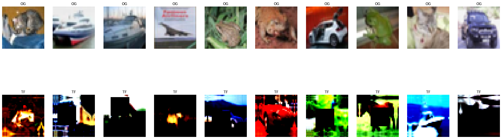
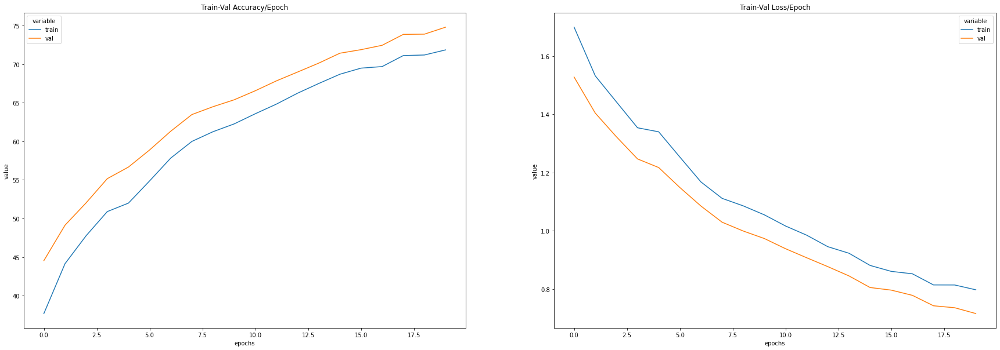
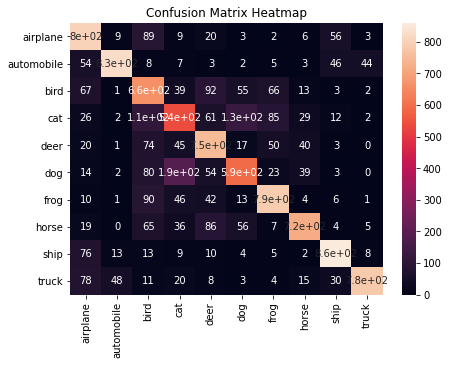
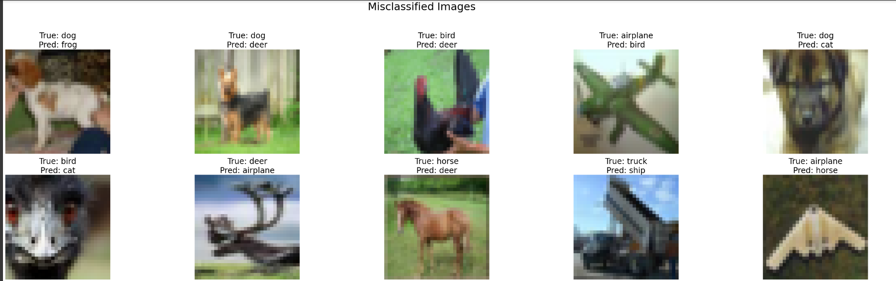
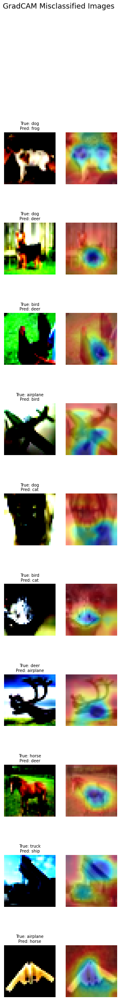

# Assignment 8

This assignment is on GradCAM. The final notebook is `final_eva6_assignment_8.ipynb`.

The folder structure is as follows -

```
- app
    - models
    - datasets
    - explainibility
    - utils
- main.py
- final_eva6_assignment_8
```

The `models` folder contains the code for ResNet. The `datsets` folder contains the PyTorch dataset for CIFAR10. The `explainibility` folder contains code for GradCAM and `utils` folder contains all the other misc functions such as train/test loops, visualization, transformations etc.

## Image Transformations



## Loss Acc Curves



## Confusion Matrix



## Misclassified Examples



## GradCAM


